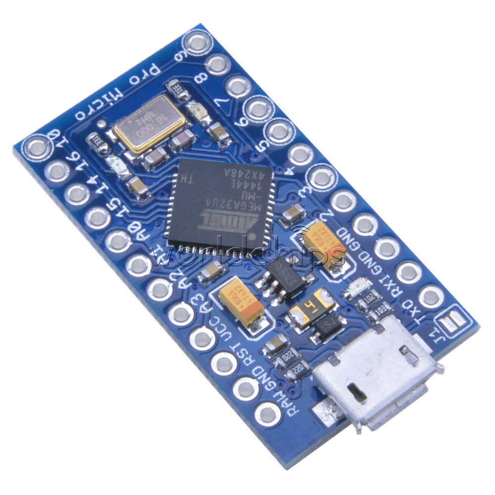

# Rick USBley

A Stupid hackathon hack that's never gonna give you up.

## How does it work?

It's a small Arduino running a custom firmware using the [LUFA framework](http://www.fourwalledcubicle.com/LUFA.php), which allows you to emulate lots of different USB peripherals using a regular atmega32u4, when plugged into a computer it shows up as a standard usb microphone, and if you listen to it, it's looping through a few notes from Rick Astleys never ending [hit](https://www.youtube.com/watch?v=dQw4w9WgXcQ).

## librick

A small portable, fixed point rickrolling synth library, takes a sample rate and provides a stream of 8 bit audio samples.

## Hardware

Arduino Micro

